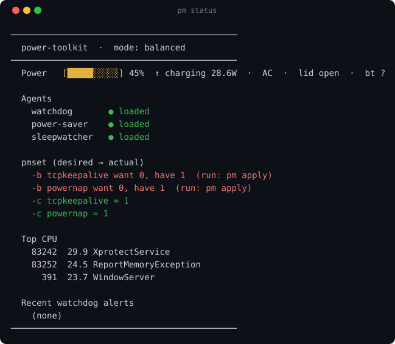

# power-toolkit

Unified energy + computation management for macOS. One config file drives everything; one CLI (`pm`) operates it.


---

## Quick start

```sh
git clone https://github.com/loganrooks/power-toolkit && cd power-toolkit
./install.sh     # installs deps (blueutil, sleepwatcher), symlinks `pm` to ~/bin, applies config
pm status        # dashboard
pm doctor        # health check
```

---

## Why

A stuck `pyenv` shim pegged a CPU core at 99% for ~44 hours and silently drained the laptop battery overnight. Separately, an overnight Bluetooth/network "dark wake" loop kept the machine from sleeping. The fixes existed — a launchd plist here, a shell one-liner there, a sleep hook somewhere else — but they were scattered and fragile. This repo consolidates them into one git-versioned, idempotent, inspectable place driven by a single config file and a `pm` CLI.

---

## Features

- **CPU watchdog** — notifies (optionally kills, off by default) any non-system process that pegs a CPU core *continuously* past a threshold (default 85% for ~15 min). Brief bursty spikes and known-heavy system daemons (Spotlight, `mediaanalysisd`, backup, etc.) are deliberately excluded so it does not false-alarm.
- **Memory guardian** *(observe mode)* — watches *every* process for runaway memory growth (the swap-exhaustion failure mode where one process balloons to many GB and fills swap) using a **headroom-aware risk score** and per-process **profiles** (system / trusted-app / dev-runtime / ephemeral / unknown) rather than a flat RSS ceiling. A sustained-growth gate means a transient burst (a browser loading a page) is not mistaken for a runaway. Steady-state cost is one `ps` per tick (~0.06 s CPU / 3 MB). It currently runs **observe-only** — logging the action it *would* take — with notify / auto-kill (opt-in per profile, ephemeral-only, *never* system or VM processes) as the next step.
- **Bluetooth-on-sleep saver** — turns Bluetooth OFF only after the lid has been shut for a while (default 30 min), so quick "walking to another room" closures keep Bluetooth on. Restores Bluetooth instantly on lid-open. Battery-only by default.
- **pmset reconciler** — keeps macOS power settings matching a declared desired state; e.g. `tcpkeepalive` and `powernap` OFF on battery, ON when plugged in. `pm status` shows any drift; `pm apply` corrects it.

---

## Requirements

- macOS on Apple Silicon (built and tested there)
- zsh
- Homebrew
- `blueutil` — Bluetooth toggle (`brew install blueutil`)
- `sleepwatcher` — instant sleep/wake hooks (`brew install sleepwatcher`)

If either dependency is missing, the relevant feature degrades gracefully; the rest of the toolkit continues to work. `install.sh` installs both automatically if Homebrew is present.

---

## Install

```sh
git clone <repo-url> && cd power-toolkit && ./install.sh
```

`install.sh` installs `blueutil` and `sleepwatcher` via Homebrew (if not already present), symlinks `pm` to `~/bin/pm`, and runs `pm apply`.

You may need to add `~/bin` to your PATH if it is not already there:

```sh
# in ~/.zshrc
export PATH="$HOME/bin:$PATH"
```

`pm apply` will prompt for sudo to set the pmset values, which are root-owned.

---

## Usage

### Commands

| Command | Description |
|---|---|
| `pm status` | Dashboard (default when no argument is given) |
| `pm apply` | Reconcile pmset + reload agents from `config.sh` |
| `pm install` | First-time setup: deps, symlink, apply |
| `pm uninstall` | Remove agents/hooks, re-enable Bluetooth |
| `pm doctor` | Health check |
| `pm mode [name]` | Switch mode: `balanced` \| `aggressive` \| `conservative` |
| `pm logs [watchdog\|mem\|saver]` | Follow agent logs |

### `pm status` output



```
────────────────────────────────────────────
  power-toolkit  ·  mode: balanced
────────────────────────────────────────────
  Power     Battery   31%   ~0.0 W   lid:open   bt:?

  Agents
    cpu-watchdog   loaded
    mem-watchdog   loaded      (observe mode — logs would-be actions, no kills)
    power-saver    loaded
    sleepwatcher   loaded

  pmset (desired → actual)
    -b tcpkeepalive want 0, have 1  (run: pm apply)
    -b powernap want 0, have 1  (run: pm apply)
    -c tcpkeepalive = 1
    -c powernap = 1

  Top CPU
      391  42.9 WindowServer
    76130  35.5 mediaanalysisd
      709  33.9 NotificationCenter

  Recent watchdog alerts
    (none)
────────────────────────────────────────────
```

---

## Configuration

All behavior is controlled by `config.sh` at the repo root — thresholds, allowlists, memory risk weights / profiles, Bluetooth timing, pmset desired state, and the active mode. Every component (the `pm` CLI, the CPU watchdog, the memory guardian, the saver, the sleep/wake hooks) sources this file at runtime.

**Workflow:** edit `config.sh`, then run `pm apply`.

### Modes

Set with `pm mode <name>`; stored in `var/mode`.

| Mode | Description |
|---|---|
| `balanced` | Default. Notify-only watchdog, 30-min BT drop, standard pmset. |
| `aggressive` | Auto-kill CPU offenders, 15-min BT drop, faster memory poll (30 s), adds `womp 0` and `standby 1` on battery. |
| `conservative` | No auto-kill, 60-min BT drop, minimal pmset touch (battery `tcpkeepalive 0` only). |

### Key knobs in `config.sh`

```sh
CPU_THRESHOLD=85          # %CPU; ~100 = one core fully pegged
SUSTAIN_MIN=15            # minutes sustained above threshold before alerting
AUTO_KILL=0               # 1 = SIGTERM the offender (allowlist always protected)

AGG_ENABLE=1              # aggregate gate: catch MANY sub-threshold hogs (detection-only)
AGG_LOAD_PER_CORE=2.5     # 1-min load average / ncpu above this = oversubscribed
AGG_SUSTAIN_MIN=10        # minutes sustained above threshold before alerting

BT_DROP_AFTER_MIN=30      # lid closed this long → Bluetooth off
BT_DROP_ON_BATTERY_ONLY=1 # 1 = only act when unplugged

PMSET_DESIRED=(
  "b tcpkeepalive 0"
  "b powernap 0"
  "c tcpkeepalive 1"
  "c powernap 1"
)
```

### Label prefix

The launchd label prefix defaults to `local.powertoolkit` and can be overridden by setting `PT_LABEL_PREFIX` in the environment before sourcing `config.sh`. This is useful if you run multiple instances or want a custom reverse-DNS prefix.

---

## How it works

**All four agents are registered with `ProcessType Background`** in their launchd plists. This tells launchd to run them only when the machine is already awake — they never trigger a wake just to execute. The plists are generated at install/apply time with fully resolved paths so the repo itself contains no hardcoded machine-specific values.

**CPU watchdog** — samples `ps` output every 300 s (configurable). It tracks per-process CPU accumulation across ticks rather than reading an instantaneous snapshot, so a process must *sustain* high CPU for roughly `SUSTAIN_MIN` minutes before an alert fires. Two allowlists gate the logic: `KILL_ALLOWLIST` protects processes that must never be terminated (kernel, WindowServer, etc.); `ALERT_ALLOWLIST` silences known batch daemons (`mediaanalysisd`, Spotlight, `backupd`, etc.) that routinely peg a core doing self-limiting work.

**CPU watchdog — aggregate gate.** A per-process threshold has a structural blind spot: many runaway processes divide the fixed CPU supply among themselves, so each one's %CPU *falls* as the fleet grows. Past a certain count they all sit below `CPU_THRESHOLD` and the watchdog goes quiet exactly as the machine gets worse — detection sensitivity ends up inversely proportional to severity. (Observed 2026-07-26: 6 orphaned busy-loops at ~97% each alerted correctly; once 36 were running at ~22% each — load 142 on 10 cores, 0.0% idle — nothing alerted for ~9 hours.) The aggregate gate closes this by watching the *system* instead of any process: it compares 1-minute load average per core against `AGG_LOAD_PER_CORE`, sustained over `AGG_SUSTAIN_MIN`. It logs `AGG-DISTRIBUTED` and notifies when the system is saturated but nothing crossed the per-process threshold — the blind-spot signature — and logs a quieter `AGG` when a per-process alert already named a culprit, so you never get two notifications for one event. Contributor totals are accumulated inside the existing `ps` pass (no second scan); ranking them shells out to `sort` only when an alert actually fires.

**The aggregate gate never kills, in any mode** — including `aggressive`. `AUTO_KILL` governs the per-process path only. This is deliberate: an aggregate signal establishes that the system is saturated but not *which* process is at fault, and 36 orphaned busy-loops are indistinguishable from a legitimate `make -j16` by load signature alone. Severity does not license termination; attribution does. Design rationale and the conditions for revisiting it are recorded in the private goal package.

**Memory guardian** — samples `ps` once per tick (default 60 s) for per-process RSS, plus a few O(1) sysctls (`kern.memorystatus_vm_pressure_level`, `kern.memorystatus_level`, `vm.swapusage`) for system headroom — no extra per-process scans. Each process is classified into a profile with a *relative* tolerance, and scored by `risk = w₁·(RSS/baseline) + w₂·growth + w₃·(1/tolerance) − w₄·foreground`; a process must grow for `MEM_SUSTAIN_TICKS` consecutive ticks (or already be a large multiple of its baseline) before any action is considered, and only as system headroom shrinks. The `system` profile — kernel, WindowServer, launchd, the live session, `com.apple.Virtualization*`, etc. — is never targeted regardless of RSS. **Currently observe-only:** it logs the action it *would* take (`watch` / `would-notify` / `would-kill`) with the supporting risk, growth, profile, and headroom, so the scoring can be validated before any kill behavior is enabled.

**Bluetooth-on-sleep saver** — the `on-sleep` hook (run instantly by `sleepwatcher`) records the timestamp when the lid closes. The saver agent ticks every 300 s and checks whether the lid has been closed longer than `BT_DROP_AFTER_MIN`. If so, it calls `blueutil -p 0` and writes a sentinel file. The `on-wake` hook runs instantly when the lid reopens, calls `blueutil -p 1`, and removes the sentinel. Short closures — under the threshold — never touch Bluetooth.

**pmset reconciler** — `pm apply` reads `PMSET_DESIRED`, compares each entry against `pmset -g custom`, and calls `sudo pmset` only for values that differ. `pm status` performs the same comparison read-only and highlights drift in red. Since pmset state survives reboots, `pm apply` is idempotent and safe to re-run.

---

## Permissions & caveats

power-toolkit drives two Homebrew CLI tools, so the entries that show up in **System Settings → Privacy & Security** are named after those tools. (A custom app name + icon would require shipping a signed `.app` — out of scope for a CLI utility.)

| Entry | Created by | Needed? |
|---|---|---|
| **Bluetooth** | `blueutil` | **Yes** — required for the Bluetooth saver to toggle the radio. |
| **Input Monitoring** | `sleepwatcher` | **No** — safe to deny. It's only for sleepwatcher's idle-detection feature, which this tool does not use; sleep/wake hooks work regardless. |
| **Notifications** (shown as *Script Editor*) | `osascript` | Optional — watchdog alerts are sent via `osascript`, so they appear under "Script Editor". |

**Bluetooth permission** — `blueutil` requires the macOS Bluetooth permission to toggle the radio. Grant it in System Settings > Privacy & Security > Bluetooth. Without it, the Bluetooth saver is a no-op and `pm doctor` will flag the check.

**sleepwatcher Input Monitoring prompt** — sleepwatcher may prompt for Input Monitoring permission. This is for its idle-detection feature, which power-toolkit does **not** use. You can safely **deny** it; the sleep/wake hooks work regardless.

**pmset sudo** — `pm apply` needs sudo to write pmset values because they are stored in a root-owned preference file. The command will prompt for your password if not already running as root. You can also run `sudo pm apply` directly.

---

## Uninstall

```sh
pm uninstall
```

This removes all four launchd agents, deletes their plists, removes the `~/bin/pm` symlink, and re-enables Bluetooth if it was turned off by the saver.

pmset values are intentionally left as-is after uninstall. To revert them manually:

```sh
sudo pmset -b tcpkeepalive 1
sudo pmset -b powernap 1
```

---

## Repository layout

```
config.sh        single source of truth — thresholds, policies, pmset state, modes
bin/pm           the CLI
libexec/         cpu-watchdog.sh  mem-watchdog.sh  power-saver.sh  on-sleep  on-wake
var/             state + logs (gitignored)
docs/            review-gates.md — the PR review gates and how to reuse them
.github/         lint + review-gate workflows, ruleset, bootstrap script
```

---

## Contributing

Pull requests are gated on more than CI. Every reviewer thread — from a bot or a human —
must be **replied to, reacted to, and resolved** before merge; a rejection with reasons is
a fine outcome, a silent resolve is not. The mechanics, the `review-verdict` block format,
and a one-command script to apply the same gates to another repo are in
[`docs/review-gates.md`](docs/review-gates.md).

---

## License

MIT — see LICENSE. Copyright 2026 Logan Rooks.
